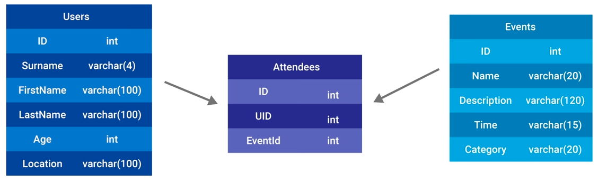

# SQL to Firebase
Following along with David East's youtube tutorial on [Converting SQL structures to Firebase structures - The Firebase Database For SQL Developers #2](https://www.youtube.com/watch?v=ran_Ylug7AE).

## Starting Out
We start with a SQL database structure that has a `Users` table, an `Events` table, and an `Attendees` table. `Attendees` is a table that relates `Users` to `Events`. The tables look like this: 

The queries to create these tables are as follows:

```sql
CREATE TABLE users(
	id SERIAL PRIMARY KEY,
	surname VARCHAR(4),
	first_name VARCHAR(100) NOT NULL,
	last_name VARCHAR(100),
	age INT,
	location VARCHAR(100)
);

CREATE TABLE events(
	id SERIAL PRIMARY KEY,
	name VARCHAR(20) NOT NULL,
	description VARCHAR(120),
	time TIMESTAMP,
	category VARCHAR(20)
);

CREATE TABLE attendees(
	user_id INT REFERENCES users,
	event_id INT REFERENCES events,
	PRIMARY KEY(user_id, event_id)	
);

DROP TABLE attendees;
DROP TABLE events;
DROP TABLE users;

INSERT INTO users (surname, first_name, last_name, age, location)
VALUES ('MR', 'Luke', 'Schlangen', 26, 'Minneapolis');

```
